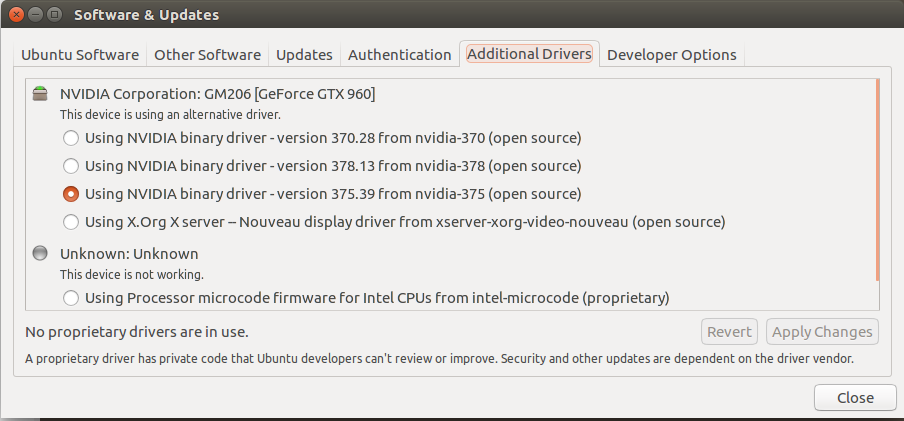
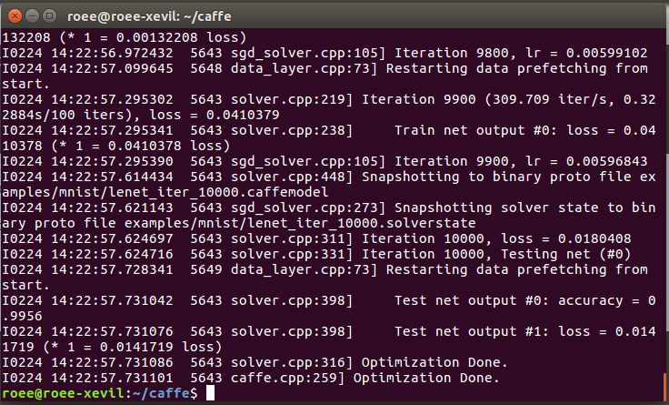
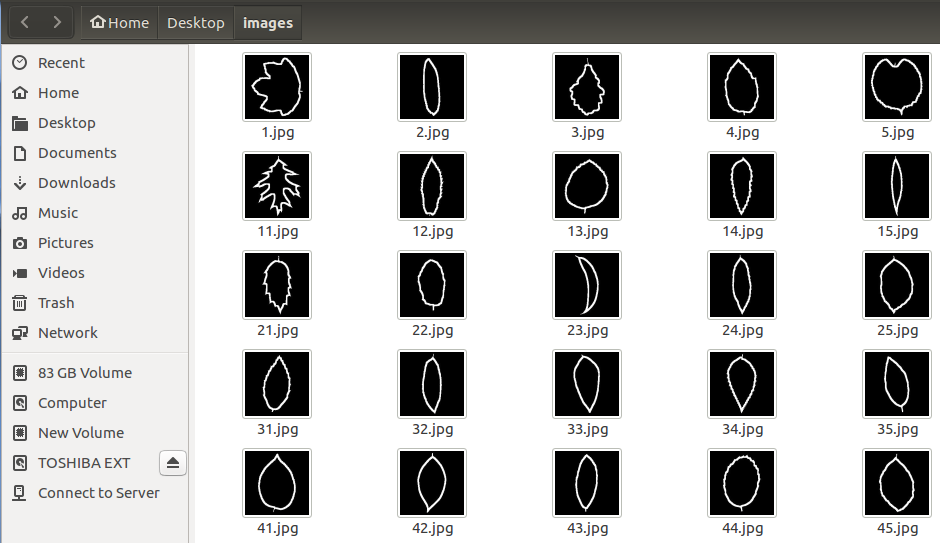
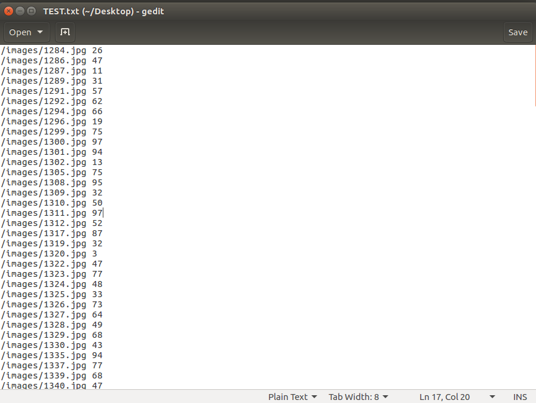

## 简介 ##
直到现在才对学习的caffe框架进行总结，东西比较多。
caffe已经被扩展到了Windows和Linux底下，两种方式我都有尝试，里面的坎坷还不是一般的多，简单来讲并不好上手，个人建议了解为主，以后有针对性地使用。
优点：数据转化为DB格式，处理起来的速度是及其快的；
缺点：全程C代码编写，不对框架十分了解的话会出现很多小毛病。
刚刚年前caffe框架更新，导致我编写的层在编译的时候都报错了。郁闷！
本文将介绍caffe在ubuntu下的编译和使用，例子：手写数字体识别。

<!--more-->

## caffe + ubuntu16.04LTS + cuda8.0 + GTX960##
对于什么都没有的ubuntu16.04LTS，需要先安装驱动和各种附加包。
### 安装依赖项 ###

	sudo apt-get install libprotobuf-dev libleveldb-dev libsnappy-dev libopencv-dev libhdf5-serial-dev protobuf-compiler 
	sudo apt-get install --no-install-recommends libboost-all-dev
	sudo apt-get install libopenblas-dev liblapack-dev libatlas-base-dev
	sudo apt-get install libgflags-dev libgoogle-glog-dev liblmdb-dev
	
### 安装显卡驱动 ###
注：如果只用CPU编译，可以跳过此部分。
#### 方式一 ####
左上角（`win`键）-> 附加驱动（additional drivers）

然后就能看到驱动了。
#### 方式二 ####
 进入[http://www.geforce.cn/drivers](http://www.geforce.cn/drivers/ "drivers") ，选择合适的驱动下载。
 下载得到的文件是`.run`文件。
 卸载已经存在的驱动版本
 
 	sudo apt-get remove --purge nvidia*
 	
 `Ctrl+Alt+F1`切换到tty1控制台后，输入

	sudo service lightdm stop
	init 3

接下来

	sudo ./NVIDIA.run#文件路径

开始安装。
期间不同电脑会有不同的问题出现。我有碰到过硬盘保护的情况，不过按照提示进行操作就可以了。
另外，既然做了千万不要半途而废，我反复了好几次才把事情搞定，还不如一开始一口气做到底。
#### 方式三 ####
直接在命令行下载驱动，也要进行进入tty1的操作，同方法二。

	sudo add-apt-repository ppa:xorg-edgers/ppa
	sudo apt-get update
	sudo apt-get install nvidia-378 #自己指定的版本

这个方法我曾经尝试过，一定是可行的，不过细节方面可以上网查询下。

### 安装CUDA ###

CUDA是NVIDIA的编程语言平台，想使用GPU就必须要使用cuda。
进入[https://developer.nvidia.com/cuda-downloads](https://developer.nvidia.com/cuda-downloads"cuda")下载cuda。

	sudo sh cuda_8.0.27_linux.run#你的版本

其中有确认是否安装显卡驱动，根据自己选择来进行安装。

打开`~/.bashrc`
	
	sudo gedit ~/.bashrc
将以下内容写到尾部

	export PATH=/usr/local/cuda-8.0/bin${PATH:+:${PATH}}
	export LD_LIBRARY_PATH=/usr/local/cuda-8.0/lib64${LD_LIBRARY_PATH:+:${LD_LIBRARY_PATH}}

### 安装CUDNN ###
进入[https://developer.nvidia.com/rdp/cudnn-download](https://developer.nvidia.com/rdp/cudnn-download"cudnn")，需要注册一个账号，选择对应版本下载。
下载之后解压。
进入`include`目录

	sudo cp cudnn.h /usr/local/cuda/include/    #复制头文件
	
返回在进入`lib64`目录

	sudo cp lib* /usr/local/cuda/lib64/    #复制动态链接库
	cd /usr/local/cuda/lib64/
	sudo rm -rf libcudnn.so libcudnn.so.5    #删除原有动态文件
	sudo ln -s libcudnn.so.5.1.5 libcudnn.so.5  #生成软衔接，注意版本
	sudo ln -s libcudnn.so.5 libcudnn.so      #生成软链接

### 安装OPENCV ###
进入[http://opencv.org/downloads.html](http://opencv.org/downloads.html"opencv")下载并解压，进入文件夹

	mkdir build
	cd build
	cmake -D CMAKE_BUILD_TYPE=Release -D CMAKE_INSTALL_PREFIX=/usr/local ..  #cmake自己装
	make -j8#完成后一定要记得下一步install
	sudo make install
	
如果出现以下错误

	modules/cudalegacy/src/graphcuts.cpp:120:54: error: ‘NppiGraphcutState’ has not been declared typedef NppStatus (*init_func_t)(NppiSize oSize, NppiGraphcutState** ppState, Npp8u* pDeviceMem);

这是因为opecv3.0与cuda8.0不兼容导致的。解决办法：
修改 `~/opencv/modules/cudalegacy/src/graphcuts.cpp`文件内容，将

	#if !defined (HAVE_CUDA) || defined (CUDA_DISABLER)

改为

	#if !defined (HAVE_CUDA) || defined (CUDA_DISABLER) || (CUDART_VERSION>=8000)
	
进入`/etc/ld.so.conf.d`，新建`opencv.conf`，添加
	
	/home/roee/opencv/build/lib
保存文件后，更新

	ldconfig
	
### 安装CAFFE ###
#### 从github上获取caffe ####

	
	git clone https://github.com/BVLC/caffe.git #git自己安装
	
#### 配置Makefile.config ####

复制`Makefile.config.example`为`Makefile.config`

	sudo cp Makefile.config.example Makefile.config
	sudo gedit Makefile.config

若仅用cpu，则

	将
	# CPU_ONLY := 1
	修改成： 
	CPU_ONLY := 1

若使用cudnn，则

	将
	# USE_CUDNN := 1
	修改成： 
	USE_CUDNN := 1
	
若使用的opencv版本是3的，则

	将
	# OPENCV_VERSION := 3 
	修改为： 
	OPENCV_VERSION := 3
	
若要使用Python来编写layer，则

	将
	# WITH_PYTHON_LAYER := 1 
	修改为 
	WITH_PYTHON_LAYER := 1
	
接下来一定要修改的一项

	将
	# Whatever else you find you need goes here.	
	下面的
	INCLUDE_DIRS := $(PYTHON_INCLUDE) /usr/local/include
	LIBRARY_DIRS := $(PYTHON_LIB) /usr/local/lib /usr/lib 
	修改为
	INCLUDE_DIRS := $(PYTHON_INCLUDE) /usr/local/include /usr/include/hdf5/serial
	LIBRARY_DIRS := $(PYTHON_LIB) /usr/local/lib /usr/lib /usr/lib/x86_64-linux-gnu /usr/lib/x86_64-linux-gnu/hdf5/serial

这是因为ubuntu16.04的文件包含位置发生了变化，尤其是需要用到的hdf5的位置，所以需要更改这一路径。

#### 修改Makefile文件 ####
打开Mkefile文件

	将
	NVCCFLAGS += -ccbin=$(CXX) -Xcompiler -fPIC $(COMMON_FLAGS)
	改为
	NVCCFLAGS += -D_FORCE_INLINES -ccbin=$(CXX) -Xcompiler -fPIC $(COMMON_FLAGS)
	
	将
	LIBRARIES += glog gflags protobuf boost_system boost_filesystem m hdf5_hl hdf5
	改为
	LIBRARIES += glog gflags protobuf boost_system boost_filesystem m hdf5_serial_hl hdf5_serial
	
#### 修改host_config.h文件 ####
编辑`/usr/local/cuda/include/host_config.h`

	将
	#error-- unsupported GNU version! gcc versions later than 5 are not supported!
	注释掉，即改为
	//#error-- unsupported GNU version! gcc versions later than 5 are not supported!
	
#### 编译caffe ####
	
	make all -j8
	
软链接问题报错的话，解决方法网上有，较易解决。

### 测试MNIST ###
打开caffe文件，下载mnist数据集

	sh data/mnist/get_mnist.sh
	
生成mnist的db文件

	sh examples/mnist/create_mnist.sh
	
用最lenet训练mnist数据集

	sh examples/mnist/train_lenet.sh
	
结果

	
其中`accracy = 0.9956`就是测试集的正确率。

### 训练自己的图片 ###
	
就是现在自己手头上有很多图片，想通过训练得到模型，并进行测试。
那么将你所有的图片（需要都有`label`）放到一起，交叉验证什么的方式等看完下文自己类比就行。
#### 选定图片 ####
例如我得到很多叶子的形状，都放入`images`底下

#### 生成文件路径txt ####
接下来编辑一个`txt`文件指明文件夹中的图片名称及其对应的`label`。

注意`label`一定需要数字，且要和文件路径之间有一个空格，文件结尾不要多出一个行，第一个`/`可以不需要，因为是和根目录联合写成绝对路径的，在之后的使用当中就能理解。
注：生成这个`txt`文件可以通过任何语言，比较推荐的时BASH脚本的形式，真的很方便。另外我自己编写的C语言脚本是`filetxt.c`，可以自己进行修改。

#### 使用convert_imageset生成图片DB格式文件 ####
	
	./build/tools/convert_imageset --shuffle --gray ~/Desktop ~/Desktop/TEST.txt ~/Desktop/x

这段的意思是

	convert_imageset工具的路径  选项打乱  选项灰度模式  文件路径  txt文件路径  生成DB数据的文件夹
	
其中选项还有各种其他的，例如resize图片大小等等。另外这里的`文件路径`和`txt文件路径`中的路径联合起来作为绝对路径。
这样可以生成训练集和测试集DB文件。

#### 使用prototxt进行训练的配置 ####
想好用什么网络训练你的样本。
编写网络的`prototxt`，里面包括data读入层，各种卷基层、下采样层、激活层、全连接层、损失函数层等等。具体的请在网络上找详细的caffe网络介绍。
编写网络配置的`prototxt`，里面定义了训练的迭代次数，测试次数，梯度下降方式，使用GPU还是CPU等等，并且在之中指明网络结构的`prototxt`文件。
这里我极其推荐[http://www.cnblogs.com/denny402/p/](http://www.cnblogs.com/denny402/p/)。这个作者写的博文是我见过最全面最详细的。

#### 训练与测试 ####
训练

	./build/tools/caffe train --solver=examples/leaf/lenet_solver.prototxt
	
这意思是

	caffe文件的路径 字段训练 网络结构的配置文件路径
	
测试

	./build/tools/caffe test --model=examples/leaf/lenet_solver.prototxt --weights=examples/leaf/1000_iter_lenet.caffemodel
	
这意思是

	caffe文件的路径 字段测试 网络结构的配置文件路径  训练的权值文件
	
#### 单独测试一张图片 ####
先使用compute_image_mean生成训练集的均值文件。

	./build/tools/compute_image_mean examples/leaf/train_lmdb mean.binaryproto
	
这里

	compute_image_mean路径  训练集DB数据路径  均值文件名

再编写一个`words.txt`，里面是数字类标对应的类别名称，例

	Acer_Capillipes
	Acer_Circinatum
	Acer_Mono
	Acer_Opalus
	Acer_Palmatum
	Acer_Pictum
	Acer_Platanoids
	Acer_Rubrum
	...
	
注意最后一行不要有空格或者回车，数字类标有多少，对应有几行。

用之的所有东西，测试新的一张图片应该被标记为什么`label`。
使用`classification.bin`

	./build/examples/cpp_classification/classification.bin examples/leaf/lenet.prototxt examples/leaf/lenet_iter_1000.caffemodel mean.binaryproto words.txt 1.jpg
	
这里

	classification.bin的路径  网络结构文件路径  权值模型路径  图片均值文件  类标txt  图片路径
	
例如得到

	---------- Prediction for /home/roee/Desktop/images/4.jpg ----------
	1.0000 - "Magnolia_Heptapeta"
	0.0000 - "Acer_Circinatum"
	0.0000 - "Acer_Opalus"
	0.0000 - "Acer_Palmatum"
	0.0000 - "Acer_Capillipes"

测试便完成了。
